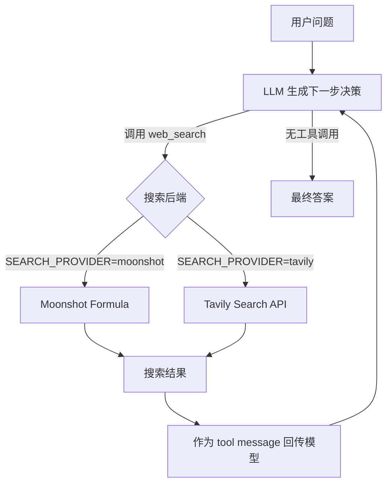
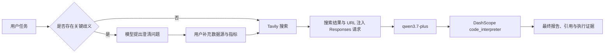

# 第 1 章实验报告

> 本文件用于集中记录第 1 章的实验报告。当前已完成实验 1-1，后续实验可继续追加到本文档。

---

## 实验 1-1：上下文的关键作用

### 1. 实验目的

本实验通过逐项移除 Agent 在多轮执行过程中可见的上下文组件，观察以下因素对 Agent 行为的影响：

- 历史消息是否能帮助 Agent 保持任务进度并避免重复操作
- reasoning 内容是否影响任务规划和执行效率
- 工具定义是否决定 Agent 能否与外部世界交互
- 工具结果是否是后续决策和计算的必要反馈

实验采用五组对照：完整上下文 `full`，以及四种消融模式 `no_history`、`no_reasoning`、`no_tool_calls` 和 `no_tool_results`。

### 2. 实验环境

| 项目 | 配置 |
| --- | --- |
| 运行入口 | `chapter1/context/main.py --mode ablation` |
| Provider | `openai` |
| Model | `mimo-v2.5-pro` |
| API Endpoint | `https://token-plan-cn.xiaomimimo.com/v1` |
| 任务案例 | `Multinational Budget` |
| 最大迭代轮数 | 10 |
| 工具 | `parse_pdf`、`convert_currency`、`calculate`、`code_interpreter` |
| 运行时间 | 2026-09-15 23:03 至 23:09（本地时间） |

API Key 来自本地 `.env`，没有写入报告。

### 3. 实验任务

任务要求 Agent：

1. 解析一个 PDF 并提取其中的金额信息
2. 处理美国、英国、日本、欧盟和新加坡五个地区的费用
3. 将不同货币统一转换为 USD
4. 计算全球总费用、平均费用和各地区占比
5. 计算统一执行 8% 成本削减后的本地货币金额

本次使用的 PDF 实际是 Adobe Vendor Security Review Program 白皮书，并不包含题目声称的 Q1 2024 区域费用数据。模型最终识别到这一点，并使用用户消息中明确提供的五组费用继续计算。这是任务设计中的一个数据一致性问题，后文会单独讨论。

### 4. 消融方式

| 模式 | 被移除的上下文 | 实际效果 |
| --- | --- | --- |
| `full` | 无 | 保留完整对话、工具调用、工具结果和历史 reasoning |
| `no_history` | 历史消息 | 每轮只发送 system prompt 和当前 user task，模型看不到之前的 assistant/tool 消息 |
| `no_reasoning` | 历史 `reasoning_content` | 工具结果和其他历史消息保留，但历史 assistant reasoning 被移除 |
| `no_tool_calls` | 工具定义 | 请求中不包含 `tools` 和 `tool_choice`，模型无法真正发起工具调用 |
| `no_tool_results` | 工具结果内容 | 工具仍实际执行，但返回给模型的 tool message 内容为空 |

### 5. 实验结果

#### 5.1 汇总表

| Context Mode | Completed | Figures | Time | Iterations | Tool Calls | Reasoning Steps | Final Answer |
| --- | :---: | --- | ---: | ---: | ---: | ---: | :---: |
| `full` | 是 | saw tools | 59.5 s | 8 | 7 | 8 | 是 |
| `no_history` | 否 | - | 64.06 s | 10 | 10 | 10 | 否 |
| `no_reasoning` | 是 | saw tools | 57.41 s | 4 | 7 | 4 | 是 |
| `no_tool_calls` | 是 | none | 46.06 s | 1 | 0 | 1 | 是 |
| `no_tool_results` | 否 | - | 98.91 s | 10 | 10 | 10 | 否 |

终止响应率为 `3/5`。


#### 5.2 对照矩阵

| Context Mode | Multinational Budget |
| --- | --- |
| `full` | 成功，8 iterations / 7 tool calls |
| `no_history` | 未终止，10 iterations / 10 tool calls |
| `no_reasoning` | 成功，4 iterations / 7 tool calls |
| `no_tool_calls` | 终止，1 iteration / 0 tool calls |
| `no_tool_results` | 未终止，10 iterations / 10 tool calls |

矩阵中的“成功”只表示模型产生了终止文本，不代表任务答案一定正确。`no_tool_calls` 尤其需要结合 groundedness 检查，不能因为它快速输出文字就认为任务完成。

#### 5.3 运行过程中的补充截图

该截图展示了另一次单任务执行的终止响应以及货币转换结果，可作为工具调用和多轮执行过程的辅助示例。它不是本次五臂消融汇总表的替代数据。


### 6. 结果分析

#### 6.1 `full`：完整上下文能够完成任务，但不保证少轮完成

`full` 在第 1 轮解析 PDF，随后执行多次汇率转换，再使用代码解释器和计算器完成汇总，最终在第 8 轮返回答案。

日志显示完整上下文保留了：

- PDF 解析结果
- 各种货币转换结果
- 代码计算结果
- 每一轮 assistant 的工具决策
- 历史 reasoning 内容

这说明完整上下文为模型提供了完成任务所需的信息链。不过，“完整上下文”只能保证信息可见，不能保证模型一定采用最短路径。模型仍然可能多次调用工具或额外验证。

#### 6.2 `no_history`：重复调用 PDF 解析

该模式每轮都只看到原始任务，因此模型在第 1、2、3 轮及后续轮次重复调用同一个 `parse_pdf` 工具。

它虽然实际执行了 PDF 解析，但下一轮看不到解析结果，无法知道自己已经完成了这一步。因此在达到 10 轮上限前始终没有形成最终答案。

这直接体现了历史消息的作用：历史不仅是“聊天记录”，也是 Agent 的执行状态和已完成动作的记录。

#### 6.3 `no_reasoning`：本次没有退化

本次 `no_reasoning` 在 4 轮内完成，比 `full` 少 4 轮。该结果不支持“去掉 reasoning 必然导致任务失败”这一更强的结论。

原因是本实验的 `no_reasoning` 只删除历史中保留的 reasoning 内容，模型在当前请求中仍然可以重新生成 reasoning，并且工具结果仍然完整可见。对于步骤相对明确的任务，工具结果本身可能已经足以支持下一步决策。

因此，本次实验只能说明：在当前模型、任务和随机运行条件下，移除历史 reasoning 没有造成可观察的性能退化。

#### 6.4 `no_tool_calls`：可以输出答案，但不能完成外部操作

该模式没有工具定义，模型无法调用任何工具，因此在第 1 轮就输出了终止文本。

这种“完成”是表面完成：模型无法解析 PDF，也无法通过工具获取汇率或验证计算。如果它仍然给出具体数字，这些数字可能来自模型记忆或自行估算，不能视为由工具观测支持的答案。

所以 `no_tool_calls` 的 `Completed = 是` 不等于任务成功，必须和 groundedness、任务级评分一起解释。

#### 6.5 `no_tool_results`：工具执行了，但模型处于信息盲区

在该模式中，工具仍然被实际执行，但返回给模型的内容为空。模型看不到：

- PDF 是否解析成功
- 汇率转换得到什么数值
- 计算器返回了什么结果

因此它重复尝试解析 PDF、调用汇率工具和计算器，最终达到 10 轮上限，未产生终止答案。该模式耗时最长，为 98.91 秒。

### 7. `__import__ not found` 错误说明

运行过程中出现过：

```text
Error executing code: __import__ not found
```

这是 `no_tool_results` 模式下的预期副作用，不是 API 鉴权失败或 Agent 主程序崩溃。

由于模型看不到 `parse_pdf` 的结果，它尝试改用 `code_interpreter` 执行：

```python
import requests
import PyPDF2
```

而 `code_interpreter` 使用受限 Python 沙箱，未开放 `__import__`，所以导入操作被拒绝。PDF 解析应该使用已有的 `parse_pdf` 工具，代码解释器主要用于受限计算。

### 8. 结论

本次实验支持以下结论：

1. **历史消息是 Agent 执行状态的重要组成部分。** 删除历史后，模型会重复已经执行过的工具动作，并可能无法终止。
2. **工具结果是 Agent 进行后续决策的关键反馈。** 工具仍然执行但隐藏结果，仍会导致 Agent 反复尝试并达到迭代上限。
3. **工具定义决定 Agent 能否与外部世界交互。** 没有工具定义时模型仍可输出文字，但不能证明它完成了需要外部观测的任务。
4. **reasoning 的作用依赖任务和模型。** 本次去掉历史 reasoning 后反而更快完成，不能据此断言 reasoning 不重要，也不能断言去掉 reasoning 必然失败。
5. **终止响应不等于任务成功。** 评估 Agent 时需要同时检查工具观测、任务级正确性和是否出现无依据数字。

### 9. 实验局限性

- 本次只运行了一个任务案例，无法排除任务特异性影响。
- Provider、模型、温度和服务端实现都会影响结果，重复运行可能得到不同轨迹。
- 当前 `main.py` 的默认任务引用了一个不包含费用数据的 PDF，任务文本和 PDF 内容不一致。
- `main.py` 主要统计终止响应和工具行为，没有像 `run_experiment_1_1.py` 那样使用固定数字 rubric 验证答案正确性。
- 汇率工具目前使用代码中固定的示例汇率，不应将结果解释为真实金融数据。
- 本报告中的 `Completed` 仅表示是否产生终止文本，不表示业务任务一定完成。

### 10. 产物位置

本次实验生成的原始产物位于 `chapter1/context/`：

- `ablation_results.json`：逐组原始汇总结果
- `ablation_study_report.md`：程序自动生成的简要报告
- `ablation_study_results.png`：程序生成的可视化结果
- `images/`：本报告引用的实验截图

本报告当前记录的是 `main.py --mode ablation` 的通用演示实验。针对书中固定任务和严格证据验收的结果，另见 `chapter1/context/validation/` 下的 `evidence.json`。

---

## 实验 1-2：Web Search Agent 的 ReAct 搜索能力

### 1. 实验目的

本实验实现并验证一个能够调用外部搜索工具的 Web Search Agent，观察大语言模型如何通过 ReAct 循环完成需要实时信息的问题。实验重点包括：

- 让模型根据问题判断是否需要外部搜索
- 通过工具调用获取实时网页信息，而不是完全依赖模型记忆
- 将搜索结果作为下一轮上下文，支持多轮搜索和信息补充
- 比较 LLM provider 与搜索 provider 解耦后的可配置性

本实验同时对原始 Kimi 专用实现进行了改造：LLM 模型通过共享 provider 配置加载，搜索服务可以在 Moonshot Formula 和 Tavily 之间切换。

### 2. 实验环境

| 项目 | 配置 |
| --- | --- |
| 运行入口 | `chapter1/web-search-agent/main.py`、`examples.py` |
| LLM Provider | `openai` 兼容接口 |
| Model | `mimo-v2.5-pro` |
| LLM API Endpoint | `https://token-plan-cn.xiaomimimo.com/v1` |
| Search Provider | `tavily` |
| 最大迭代轮数 | `.env` 配置，当前为 20 |
| 配置文件 | `chapter1/web-search-agent/.env` |
| 依赖 | `openai`、`requests`、`python-dotenv` |

API Key 均来自本地 `.env`，没有写入本报告。截图运行时间为 2026-09-16。

### 3. Agent 架构



工具名称统一为 `web_search`，因此模型无需知道底层使用的是哪一个搜索服务。Moonshot 模式通过 `moonshot/web-search:latest` Formula 获取工具定义并执行 Fiber；Tavily 模式则使用本地声明的 OpenAI-compatible function tool，并向 Tavily `/search` 接口发送查询。

### 4. 配置方式

当前实验配置如下：

```env
LLM_PROVIDER=openai
OPENAI_BASE_URL=https://token-plan-cn.xiaomimimo.com/v1
MODEL_NAME=mimo-v2.5-pro
SEARCH_PROVIDER=tavily
TAVILY_API_KEY=***
MAX_SEARCH_ITERATIONS=20
```

配置加载顺序为：程序启动时先加载脚本目录下的 `.env`，然后构建命令行参数；如果命令行显式提供 `--provider`、`--model` 或 `--search-provider`，则命令行参数覆盖配置文件。

典型运行命令：

```bash
cd chapter1/web-search-agent
python examples.py
python main.py "2024 年诺贝尔物理学奖获得者是谁？"
```

也可以临时切换搜索后端：

```bash
python main.py "最新人工智能新闻" --search-provider tavily
```

### 5. ReAct 执行过程

以“2024 年诺贝尔物理学奖获得者是谁？”为例，执行过程可以概括为：

1. 模型分析问题，判断需要查询实时信息
2. 模型生成 `web_search` 工具调用和查询关键词
3. Agent 执行 Tavily 搜索并获得结果
4. 搜索结果以 `tool` 消息加入对话历史
5. 模型根据结果生成答案，必要时继续搜索或补充验证
6. 当模型不再请求工具时，Agent 输出最终答案

截图中可以观察到完整的“思考、行动、观察、最终答案”轨迹。模型不仅给出了搜索关键词，还在搜索后整理了获奖者、获奖原因、研究贡献和来源信息。


### 6. 高级示例运行结果

`examples.py` 提供了基础搜索、批量搜索、上下文搜索、比较搜索、事实核查和研究助手六类用法。批量搜索示例会逐个处理问题，并在每个问题完成后清空会话历史，避免前一个问题污染后一个问题。

截图中的高级示例展示了：

- 多个搜索问题连续执行
- 每轮都产生 `web_search` 行动
- 模型根据搜索结果继续进行后续查询
- 最终生成带有结构化内容的回答
- 同一 Agent 可以执行多个不同主题的研究任务


### 7. 实验现象与分析

#### 7.1 工具调用使模型具备实时信息获取能力

如果没有搜索工具，模型只能使用训练数据和上下文中的信息。加入 `web_search` 后，模型可以针对问题生成查询词，从外部服务获取结果，再根据观察结果组织回答。这个过程体现了 Agent 与普通问答模型的区别：模型不只是生成文本，还能决定并执行外部行动。

#### 7.2 搜索结果是后续推理的重要上下文

工具返回结果后，Agent 将其作为 `tool` 消息追加到对话历史。下一轮模型请求能够看到自己的工具调用和对应观察结果，因此可以判断信息是否足够，并决定直接回答还是继续检索。若隐藏工具结果，模型无法可靠判断搜索是否成功，也容易重复执行相同操作。

#### 7.3 多轮搜索比单次搜索更适合复杂问题

对于“最新状态”“比较多个对象”或需要交叉验证的问题，第一次搜索通常只能得到部分证据。当前 ReAct 循环允许模型在观察结果后生成新的搜索请求，从而补充缺失信息。截图中的交互过程显示，模型会先搜索主题，再基于第一轮结果继续查找和核对细节。

#### 7.4 LLM 与搜索服务可以独立切换

本次改造将模型 provider 和搜索 provider 分成两个配置项。`mimo-v2.5-pro` 通过 OpenAI-compatible endpoint 提供推理能力，Tavily 负责搜索，两者不要求来自同一厂商。这比原先将搜索能力绑定到 Kimi Formula 更灵活，也使其他支持 tool calling 的模型可以复用同一搜索工具。

### 8. 实验结论

1. ReAct 循环能够将模型推理、工具行动、工具观察和最终回答组织成连续执行过程。
2. 搜索工具调用让模型能够获取实时信息，降低完全依赖模型记忆带来的时效性问题。
3. 对话历史和工具结果是多轮搜索能够正常工作的基础。
4. Tavily 通过标准 function tool 接入后，可以与 `mimo-v2.5-pro` 等 OpenAI-compatible 模型协同工作。
5. 将 LLM provider 与搜索 provider 解耦后，可以分别替换模型和搜索服务，配置更加清晰。

### 9. 实验局限性

- 本次主要通过控制台截图验证流程，没有建立覆盖多个问题类型的定量准确率指标。
- 搜索结果的质量受 Tavily 返回内容、查询关键词和模型判断影响，工具调用成功不等于答案一定正确。
- 截图中的运行结果属于单次运行轨迹，模型可能因随机性、服务端状态或搜索索引变化产生不同结果。
- Tavily API Key 存放在本地 `.env`，实际协作或提交代码时应确保 `.env` 不进入版本控制，并及时轮换已经暴露过的 Key。
- `run_experiment_1_2.py` 仍是针对 Kimi K3 Formula 的专项验收脚本，不适用于当前 `mimo-v2.5-pro + Tavily` 配置；当前实验应以 `main.py` 和 `examples.py` 的运行轨迹为准。

### 10. 相关代码与截图

- `chapter1/web-search-agent/main.py`：CLI 入口和 `.env` 配置加载
- `chapter1/web-search-agent/config.py`：LLM、搜索服务和密钥配置
- `chapter1/web-search-agent/agent.py`：ReAct 循环、工具定义和 Tavily 执行逻辑
- `chapter1/web-search-agent/examples.py`：高级搜索示例
- `chapter1/web-search-agent/images/`：实验运行截图

---

## 实验 1-3：搜索与云端代码执行协同的 Deep Research Agent

### 1. 实验目的

本实验验证 Research Agent 能否将实时搜索、澄清式对话和云端 Python 代码执行组合为完整工作流。具体目标如下：

1. 使用搜索结果获取需要时效性的外部事实和来源链接。
2. 使用云端 `code_interpreter` 实际执行定量计算，而不是仅由模型在文本中声称完成计算。
3. 对信息不足的研究任务先提出澄清问题，再在用户补充约束后继续执行。
4. 将请求、工具轨迹、引用、用量和校验结果保存为可复核的证据文件。

### 2. 实验环境

| 项目 | 配置 |
| --- | --- |
| 运行入口 | `chapter1/search-codegen/run_experiment_1_3.py` |
| Responses API 后端 | DashScope 兼容接口 |
| 模型 | `qwen3.7-plus` |
| 搜索服务 | Tavily |
| 代码执行 | DashScope 托管 `code_interpreter` 沙箱 |
| 推理等级 | `high` |
| 运行时间 | 2026-09-16 03:44:46 UTC |
| 运行目录 | `validation/runs/real_20260916T034446Z/` |

模型和搜索服务的 Key 均通过 `chapter1/search-codegen/.env` 配置，未写入报告或证据文件。

### 3. 实现方案

本实验的运行链路如下：



Tavily 由 Agent 客户端调用，结果和 URL 被注入模型上下文；定量计算则由 DashScope 的云端 `code_interpreter` 执行。后者会在 Responses 返回中留下状态为 `completed` 的 `code_interpreter_call`，可证明 Python 代码确实在云端沙箱运行。

### 4. 验证任务

#### 4.1 东盟首都距离任务

任务要求收集东盟十国首都及坐标，使用 Haversine 公式枚举全部 45 组城市组合，并找出最近的一对。验收要求包括：

- 搜索调用完成并保留 URL 引用。
- `code_interpreter_call` 完成。
- 最终答案包含最近城市对和距离。
- 结果与独立本地参考值一致。

#### 4.2 比特币技术分析任务

第一轮只给出“搜索最近一个月的比特币走势，做技术分析”这一模糊需求。Agent 必须不调用工具而先询问数据源和指标；用户补充 CoinGecko、日线、MA7、MA20、RSI14、MACD、区间收益与最大回撤后，Agent 才继续搜索和执行 Python 分析。

### 5. 运行命令与验证

完整实验通过以下命令运行：

```bash
cd chapter1/search-codegen
python run_experiment_1_3.py --backends dashscope --reasoning high
```

代码质量检查命令如下：

```bash
python -m pytest -q test_responses_agent.py
python -m py_compile agent.py config.py main.py run_experiment_1_3.py
```

其中前者验证请求构造和响应解析等程序逻辑，后者只检查 Python 语法；端到端实验是否完成以运行生成的 `manifest.json` 和 `evidence.json` 为准。

### 6. 实验结果

最新运行的 `manifest.json` 记录：

```json
{
  "run_id": "real_20260916T034446Z",
  "acceptance_passed": true,
  "acceptance_backend": "dashscope"
}
```

控制台输出同样显示 DashScope 后端的东盟任务和澄清任务均通过：


#### 6.1 东盟任务结果

| 验证项 | 结果 |
| --- | --- |
| 请求成功 | 通过 |
| Tavily 搜索调用 | 通过 |
| 云端 `code_interpreter_call` | 通过 |
| URL 引用 | 通过 |
| 最近城市对 | 吉隆坡 - 新加坡 |
| 独立参考距离 | 309.3 km |
| 任务验收 | 通过 |

模型在云端 Python 沙箱中使用地球平均半径 6,371 km 的 Haversine 公式，完成 45 组城市对的计算。最终得到吉隆坡和新加坡最近，模型输出约 309.25 km；验证器以 309.3 km 的独立参考值进行核对并通过。

证据中东盟请求耗时约 94.62 秒，返回项包含 `reasoning`、`code_interpreter_call` 和最终 `message`。

#### 6.2 比特币任务结果

| 验证项 | 结果 |
| --- | --- |
| 首轮在工具调用前澄清需求 | 通过 |
| 后续请求关联前一轮响应 | 通过 |
| Tavily 搜索调用 | 通过 |
| 云端 `code_interpreter_call` | 通过 |
| URL 引用 | 通过 |
| 报告 MA、RSI、MACD | 通过 |
| 任务验收 | 通过 |

首轮模型询问数据源、技术指标和 K 线周期，没有调用搜索或代码工具。补充条件后，后续请求耗时约 196.89 秒，使用了 3 次云端代码解释器调用，报告了 MA7、MA20、RSI14、MACD、30 天区间收益和最大回撤。

### 7. 结果分析

#### 7.1 搜索、推理和计算的职责分离

Tavily 提供外部网页材料及 URL，模型负责规划、解释和生成报告，云端 `code_interpreter` 负责 Haversine 距离、技术指标和绘图等可执行计算。该分工使“检索到的事实”和“可复现的计算结果”具备不同的证据来源。

#### 7.2 `code_interpreter_call` 是计算已执行的证据

东盟任务至少产生了一个状态为 `completed` 的 `code_interpreter_call`；比特币任务的后续分析产生了 3 次。它们包含运行代码、日志或输出，说明计算发生在提供商托管的云端沙箱，而不是模型仅在自然语言中模拟计算过程。

#### 7.3 澄清步骤避免在关键条件未知时盲目执行

比特币任务在未给定数据源和指标时先询问用户。后续使用 `previous_response_id` 维持上下文，使模型能够将补充要求与初始问题关联起来。验证器确认首轮没有工具调用，并确认后续轮成功完成搜索和计算。

### 8. 实验局限性

- Tavily 是由客户端调用的外部搜索服务，不是 DashScope 服务端原生 `web_search`；项目将该调用统一记录为完成的 `web_search_call` 以纳入实验验证。
- 比特币云端代码沙箱没有外网访问能力。最终报告明确说明：模型根据搜索到的 CoinGecko 市场快照和第三方指标构造了符合统计特征的 30 天序列，再执行指标计算。因此 MA、RSI、MACD 和回撤结果不能视为直接从 CoinGecko 原始日线逐条下载后得到的严格市场回测。
- 搜索结果的权威性取决于 Tavily 的检索排序和查询质量；应优先使用官方、交易所或数据提供商的一手来源。
- 云端工具的可用性、模型行为和搜索索引均可能随时间变化，重复运行的耗时、引用和生成文本可能不同。

### 9. 证据与产物

- `chapter1/search-codegen/validation/latest.json`：指向最新实验结果。
- `chapter1/search-codegen/validation/runs/real_20260916T034446Z/evidence.json`：完整的请求、响应、工具调用、引用和验收检查。
- `chapter1/search-codegen/validation/runs/real_20260916T034446Z/receipts.json`：脱敏后的原始 API 回合记录。
- `chapter1/search-codegen/validation/runs/real_20260916T034446Z/manifest.json`：证据哈希及最终验收状态。
- `chapter1/search-codegen/images/`：本报告使用的控制台验收截图。

### 10. 结论

本次实验在 DashScope `qwen3.7-plus` 后端上完成并通过验收。Agent 能够：

1. 对明确的研究任务执行搜索并调用云端 Python。
2. 对存在关键歧义的任务先澄清，再在后续轮次继续执行。
3. 通过 `code_interpreter_call`、引用和证据文件保留可核验的执行轨迹。
4. 在东盟任务中正确找出吉隆坡和新加坡这一最近首都对。

同时，实际数据的来源和可用性仍需单独评估：云端代码执行证明了计算过程，但不自动保证搜索材料、输入数据或由搜索快照拟合得到的金融序列具有同等质量。

---

## 实验 1-4：文生图工作流与原生图像生成的对照

### 1. 实验目的

本实验验证“提示词改写 + 文生图工具”的工作流路线是否能够把口语化中文需求转化为可执行的图像生成任务，并保留每个节点的请求、耗时、模型和图片哈希证据。

本次运行宽泛需求主用例“帮我画一个 AGI 实现以后程序员的工作场景”的两条路线：Mimo 改写后交给万相生成的工作流路线，以及 Qwen Image 3.0 直接理解原始中文需求的原生路线。GPT-Image 2 对照路线未在本次运行中执行。

### 2. 实验环境

| 项目 | 配置 |
| --- | --- |
| 运行入口 | `chapter1/image-gen-workflow/main.py --route workflow --requirement agi-programmer`；`--route native --requirement agi-programmer` |
| 改写模型 | `mimo-v2.5-pro` |
| 改写接口 | Mimo OpenAI 兼容 `chat/completions` |
| 生图模型 | `wan2.2-t2i-flash` |
| 生图接口 | 百炼北京业务空间 DashScope 异步文生图接口 |
| 原生生图模型 | `qwen-image-3.0` |
| 原生生图接口 | 百炼北京业务空间 DashScope 同步多模态接口 |
| 输出规格 | `1024*1024`，1 张 PNG |
| 运行时间 | Qwen 原生：2026-09-16 14:02 至 14:03；工作流：15:04 至 15:05（本地 UTC+8） |

所有密钥均从本地 `.env` 读取，报告和证据中不记录密钥值。

### 3. 路线

```text
用户中文需求
  -> Mimo：改写为英文正向提示词、负向提示词和改写说明
  -> 万相 wan2.2-t2i-flash：提交异步任务、轮询结果、下载 PNG
  -> 输出图片与调用证据
```

```text
用户中文需求
  -> Qwen Image 3.0：直接理解并生成 PNG
  -> 输出图片与调用证据
```

### 4. 结果

| 路线 | 模型链路 | 状态 | 图片大小 | SHA-256 |
| --- | --- | --- | ---: | --- |
| `workflow` | Mimo `mimo-v2.5-pro` -> 万相 `wan2.2-t2i-flash` | 成功 | 1,398,601 bytes | `3e571410c8cbac6b324a564cc27d797a0e04cfb0975ebfee95fdc74c258c54f8` |
| `native` | Qwen `qwen-image-3.0` | 成功 | 1,250,028 bytes | `1f5e49eb22d417c7b7cd08a19c158ac17c9da630a3ffb60687f7444bbfe99a17` |

原始需求为“帮我画一个 AGI 实现以后程序员的工作场景”。Mimo 将其改写为包含 post-AGI workspace、AI 协作、全息界面、自动化编程工具、赛博朋克风格和霓虹灯光的英文提示词，并使用负向提示词排除低清晰度、肢体畸形和水印等问题。


Qwen 原生路线未经过项目内的 Mimo 改写节点，直接传入原始中文需求；其配置中的 `prompt_extend=true` 允许百炼在服务端进行内置提示词增强。


### 5. 过程与耗时

| 节点 | 模型/操作 | 耗时 |
| --- | --- | ---: |
| 提示词改写 | Mimo `mimo-v2.5-pro` | 25.15 s |
| 万相任务提交 | `wan2.2-t2i-flash` | 0.24 s |
| 万相轮询至完成 | `wan2.2-t2i-flash` | 10.31 s |
| 下载生成图片 | PNG 下载 | 0.40 s |
| 全链路 | 改写、出图与下载 | 约 36.09 s |
| Qwen 原生直出 | `qwen-image-3.0` 同步调用及图片下载 | 59.25 s |

万相返回的实际提示词进一步将抽象需求具体化为高科技办公室、程序员团队、全息神经代码和 AI 虚拟形象。最终图片也呈现多人在霓虹色未来办公室中与全息界面、机器人/AI 形象协作的场景。Qwen 原生图则呈现明亮的现代办公协作空间、可穿戴设备和悬浮界面；两张图片都符合“AGI 实现后程序员工作场景”的宽泛主题。

### 6. 结果分析

本次执行可观察到两层提示词适配：

1. Mimo 将中文口语化需求转换为传统扩散模型常用的英文标签式描述，并补足了未来科技、光线和画风等细节。
2. 万相服务端又将标签式提示词扩写为更具体的场景叙述，最终生成的画面包含原始需求没有明确指定的团队、未来办公空间、全息控制台和机器人元素。

这种适配提高了宽泛需求的画面完整度，但也意味着模型替用户作出了风格和叙事选择。本例指定了赛博朋克与霓虹视觉语言，属于对“AGI 工作场景”的合理解释，而非用户原始描述中的硬性约束。

Qwen 原生路线也产生了具体叙事，但不依赖项目显式构造英文标签和负向提示词。两条路线的视觉取向不同：工作流路线更偏赛博朋克、夜景和高密度的全息技术元素；Qwen 原生路线更偏明亮、日常化的人机协作办公室。就本次单样本而言，工作流路线总耗时约 36.09 秒，低于 Qwen 原生路线的 59.25 秒；单次耗时受服务端队列影响，不能据此推广为稳定的性能结论。

### 7. 局限性

- 本次只运行了一个宽泛需求，且未运行 GPT-Image 2，不能推广为 Mimo、万相、Qwen Image 3.0 与 GPT-Image 2 的稳定质量排序。
- 图片质量评价基于单次生成，受随机性、服务端提示词扩写和内容审核策略影响。
- 万相结果链接只保留 24 小时；项目已将实际 PNG 下载到 `outputs/` 并在 manifest 中记录哈希。

### 8. 证据与产物

- `chapter1/image-gen-workflow/validation/latest.json`：最新运行的证据入口。
- `chapter1/image-gen-workflow/validation/real_20260916T070459Z/evidence.json`：完整输入、改写结果、调用记录、模型、用量、耗时与图片哈希。
- `chapter1/image-gen-workflow/validation/real_20260916T060220Z/evidence.json`：Qwen Image 3.0 原生路线的完整调用记录与图片哈希。
- `chapter1/image-gen-workflow/outputs/20260916T070459Z/images/agi-programmer_workflow.png`：本节引用的生成图片。
- `chapter1/image-gen-workflow/outputs/20260916T060220Z/images/agi-programmer_native.png`：本节引用的 Qwen 原生生成图片。
- `chapter1/image-gen-workflow/outputs/20260916T070459Z/calls/`：各节点脱敏后的请求与响应记录。

---

## 第 1 章思考题回答

### 1. 更强模型、更多上下文与更多工具如何选择

**结论：** 先定位瓶颈，再决定投资模型、上下文或工具，不能默认升级其中任一项。

**判断依据：** 任务分解、工具选择或复杂推理持续失败时，优先评估更强的 LLM；缺少领域事实、用户偏好或实时信息时，补充上下文、检索或 RAG；已经知道该做什么、却无法读取或改变外部状态时，才需要增加工具。

**工程做法：** 提供完成当前任务所需的最小工具集合，再根据失败轨迹扩展。工具过多且相似会扩大选择空间，增加误用率和上下文负担。

### 2. 如何控制 ReAct 的上下文与缓存增长

**结论：** 不能无限拼接短期记忆；应在不丢失任务状态的前提下控制动态上下文。

**方法：** 采用“收集、选择、结构化、压缩”四步。收集轨迹和工具结果；按任务目标、约束和当前步骤选择相关信息；将任务状态、已完成动作、关键事实和待办项结构化保存；最后压缩不再需要逐字保留的历史。

**工程做法：** 系统提示词和工具定义保持不变，以复用 KV Cache。动态部分保留全局目标与约束、最近若干轮原始轨迹、相关历史片段及可验证状态摘要。接近预算时使用滑动窗口、阶段性摘要或分层压缩，并把完整原始轨迹持久化到外部存储。必须保留已执行工具、结果、失败原因和不可逆决策，否则 Agent 会重复操作或作出矛盾判断。

### 3. “模型即 Agent”与 Harness 工程为何能共存

**结论：** “模型即 Agent”会减少显式编排，但不会替代 Harness；模型与 Harness 是互补关系。

**原因：** LLM 负责理解、规划和决策。模型增强后会逐步内化任务分解、工具选择和局部纠错，使部分客户端编排变薄；但工具接入、权限边界、沙箱隔离、状态持久化、结果验证、审计和人工审批仍是模型外的系统职责。

**框架价值：** 未来 Harness 的重点不是替模型写死每一步，而是以最小干预提供可靠执行基座：按需构造上下文，提供清晰工具接口，执行约束、验证与纠正，并在失败或高风险操作时安全交还控制权。即使上下文窗口扩大，成本、延迟、注意力分散和隐私约束仍使上下文工程有长期价值。

### 4. 如何检测并终止 Agent Loop

**风险来源：** 除工具结果缺失外，工具持续报错、返回内容无关或不完整、环境状态没有变化、模型反复调用同一工具、成功条件不清，以及 Reflection 持续自我优化，都可能导致循环。

**检测机制：** 监测重复工具调用、相似轨迹、环境状态无进展和连续失败次数；同时为任务定义可验证的完成条件。

**终止机制：** 限制最大迭代次数、单任务 token 和时间预算；对可重试错误采用有限次数的指数退避；连续失败后熔断、降级或转人工。Reflection 类任务还应设置质量阈值和边际收益阈值，达到合格标准或连续改进不足时结束。

### 5. 以 OpenCode 为例分析感知、行动与策略

**产品：** 我日常使用较多的是 OpenCode。

**感知、行动与策略：** 感知来自文件读取、代码搜索、终端输出、MCP 服务和用户反馈；行动来自编辑文件、执行命令、调用 MCP 工具与请求人工确认；策略由底层模型、系统提示词、`AGENTS.md`、Skills 和当前上下文共同决定。

**评价与改进：** 这种设计将执行基座与具体工作流分离，用户可按项目习惯配置工具、规则和 Skills，整体合理。可进一步降低插件开发与能力发现的门槛，并为高风险 MCP 工具提供统一的权限说明、预览和审计体验。无论工具来自内置能力还是 MCP，感知结果都应被视为可能不可信的外部输入，而不是天然可信的指令。

### 6. 航班订票应采用工作流还是自主 Agent

**常规需求：** 优先采用工作流。它依次收集出发地、目的地、日期、乘客信息和预算，查询并筛选航班，在支付前确认；成本更低、延迟更可控，也更容易验证价格、舱位和订单状态。

**复杂需求：** 对“尽量少请假、允许附近机场、优先累积里程、可接受一次中转”等模糊偏好，可由 Agent 负责澄清、规划搜索和解释取舍。

**推荐架构：** 先做意图识别与风险分流：简单任务走确定性工作流，复杂任务由 Agent 决策；下单、支付和退改等高风险步骤始终回到受约束的工作流与人工确认。

### 7. 如何对工具进行动态风险评估

**评估对象：** 风险不能只由工具名称决定，而应由“工具 + 参数 + 目标资源 + 当前上下文 + 执行环境”共同决定。删除工作区临时文件与递归删除系统目录、生产数据或工作区外文件的风险等级完全不同。

**评估方式：** 先用确定性规则检查路径范围、递归性、文件数量、资源标签、环境类型和是否可回滚，再叠加业务上下文，例如是否处于生产环境、是否已有用户授权、是否涉及敏感数据。

**处置策略：** 低风险操作可自动执行；中风险操作先展示影响范围并确认；高风险操作必须二次确认、最小权限执行并记录审计日志，必要时只允许生成计划。任何越出授权工作区的访问或修改，即使不是删除，也应默认提升风险等级。

### 8. 受限动作空间何时优于开放动作空间

**适用场景：** 业务场景固定、操作后果严重、规则明确且需要稳定审计时，受限动作空间通常优于开放动作空间。例如生产故障分析、CI/CD 中的代码审查、退款审批、工厂失效分析或工艺优化。

**优势：** 预定义动作可以用类型、权限和状态机约束参数，减少模型生成任意代码或任意命令带来的攻击面和不可预测性。

**取舍：** 开放式工具适合探索、研究和需求高度多变的任务；受限工具适合追求成本、延迟和可靠性可控的生产闭环。

### 9. 用户不在线、响应慢或指令模糊时如何移交控制

**用户不在线：** 会话状态必须可持久化、可恢复、可审计。保存任务目标、已执行动作、外部副作用、待确认事项和恢复点；可通过 checkpoint 保存图状态并在用户返回后 resume。不可逆或高风险操作应停在审批节点，不能因等待超时而自动执行。

**响应慢：** 将无依赖的检索、验证和子任务按 DAG 并行执行，并按意图复杂度做大小模型或工作流分流；固定业务尽量程序化；上下文按需管理，避免无关历史拖慢推理。

**指令模糊：** 使用意图识别和置信度检查决定是否澄清。低风险且可逆的动作可先给出候选方案；高风险、歧义大或影响范围不明时必须二次确认。

### 10. 会随模型演进而变化的工程手段

**可能过时的手段：** 将复杂现实对象先转写为自然语言、图片或音频，再交给通用 LLM 理解。例如复杂电路 Layout、三维结构、工业时序或机器人传感数据，经过文字中转会丢失几何、拓扑和物理约束。

**演进方向：** 未来领域专用的视觉、空间或世界模型可能直接编码和推理这些信息，减少中间描述与人工特征工程。

**不变原则：** 感知表示从文本扩展到多模态或行业专用表示后，系统仍需遵循“观察、决策、行动、再观察”的闭环。权限边界、状态确认、可逆操作、结果验证和安全停止仍然成立；变化的是模型和接口，实现 Agent 可控运行的 Harness 原则不会改变。

### 扩展题：以 OpenCode 为例分析 LLM、Context 与 Tools

OpenCode 是我较熟悉的代码 Agent。它本身提供运行与治理框架，底层模型、上下文和工具可以按项目与用户配置组合，因此很适合用“LLM + Context + Tools”的公式分析。

| 组件 | 在 OpenCode 中的具体体现 | 主要职责 |
| --- | --- | --- |
| LLM | 用户选择或配置的底层模型，例如 OpenAI、Anthropic、Google 或兼容 API 提供的模型 | 理解用户需求，阅读已有上下文，规划下一步，决定是否调用工具，并生成代码、解释或最终回复。LLM 负责决策，不直接拥有文件系统或终端权限。 |
| Context | 用户任务、系统与开发者指令、当前会话历史、已读取的文件内容、代码搜索结果、终端输出、`AGENTS.md`、Skills 定义、工具返回值和 MCP 提供的观察 | 为模型提供当前任务所需的“视野”。它既包含静态规则，也包含随执行增长的轨迹；上下文是否相关、完整且受控，直接影响模型能否正确决策。 |
| Tools | 文件读取与编辑、代码搜索、终端命令、测试运行、浏览器与网络工具、MCP 服务、Skills，以及向用户请求确认的交互能力 | 让模型能够感知和改变外部环境。工具执行由框架完成，结果再作为观察回传给模型，形成“思考 -> 行动 -> 观察”的 ReAct 闭环。 |

三者的协作过程如下：用户提出“修复一个测试失败”的需求后，LLM 先根据 Context 理解报错和项目规则；随后决定调用搜索、读取文件或终端测试等 Tools；工具结果回到 Context；LLM 再据此编辑代码、重新运行测试，直到达到完成条件或请求人工确认。

OpenCode 的关键价值在于 Harness：它不替模型完成推理，而是负责组织上下文、暴露工具、执行权限规则和记录执行过程。对于删除文件、运行高风险命令或访问工作区外资源等操作，最终安全性不能只依赖 LLM 的文字判断，而应由工具权限、路径范围、确认机制和审计记录共同保障。

## 学习心得

我此前已经做过简单的 Agent 开发，能够完成模型调用、工具注册、ReAct 循环和基础的文件或终端操作。本章带来的主要提升，不是重新学习如何“让模型调用工具”，而是建立了更完整的系统视角：Agent 不只是 LLM 加几个 Tools，而是由 Model、Context、Tools 和 Harness 共同组成的闭环。LLM 负责理解、规划和决策，但它只能基于当前上下文行动，也只能通过受控工具感知或改变外部环境。

结合本章实验，我进一步认识到历史消息和工具结果不仅是日志，更是 Agent 的执行状态；缺失后模型会重复操作，甚至给出看似合理却没有观测依据的答案。因此，后续开发中需要将注意力从“增加工具和提示词”扩展到 Harness 工程：管理上下文长度与状态摘要，提供边界清晰的工具接口，限制迭代、token 和时间预算，并通过权限分级、结果验证、可恢复状态和人工确认控制风险。对于规则稳定的任务，应优先选择成本和延迟更可控的工作流；只有在需求复杂、需要动态规划时再引入自主 Agent。模型会持续增强，但“观察、决策、行动、验证”的闭环，以及让 Agent 在真实环境中可靠运行的工程能力，仍然是实践中的核心竞争力。

## 课程反馈

### 1. 实验平台过于分散

课程实验覆盖了多个大模型厂商、模型平台和工具服务。这有助于了解生态差异，但实际完成实验时，需要注册、实名认证、申请 API Key、充值或开通权限的平台较多，学习者容易把大量时间花在账号配置、额度排查和接口兼容问题上，而非 Agent 原理、系统设计和实验结果分析。

### 2. 建议以统一协议降低接入成本

建议课程在主线实验中尽可能优先采用支持 OpenAI 兼容协议的模型服务，并将 `base_url`、`api_key`、`model` 等配置统一放在 `.env` 中。这样学习者可以根据已有账号或地区可用性替换模型，而无需为每个实验重写调用逻辑。课程仍可在扩展阅读中介绍不同厂商的原生 API 与特色能力，但不应让厂商差异成为完成核心实验的前置条件。

### 3. 将工具能力与模型厂商解耦

对于 Web Search 等外部能力，不建议绑定某个模型厂商的内置工具。更通用的方案是使用 Tavily 等独立搜索服务，或提供统一的本地工具适配器：模型仅通过标准化 `web_search` 工具定义发起调用，框架负责选择实际后端并将结果回传。这样可以更清晰地体现“模型负责决策、工具负责执行”的 Agent 架构，也便于学习者替换搜索提供商、控制成本，并比较不同模型在相同工具环境下的决策能力。

### 4. 总结

课程可以保留多模型、多平台的横向比较价值，但建议将其设计为可选扩展；核心实验则应聚焦统一接口、可替换配置和通用工具适配。这样能够降低环境准备成本，让学习者将更多时间投入到上下文管理、工具设计、Harness、安全约束和实验复盘等课程核心能力上。
