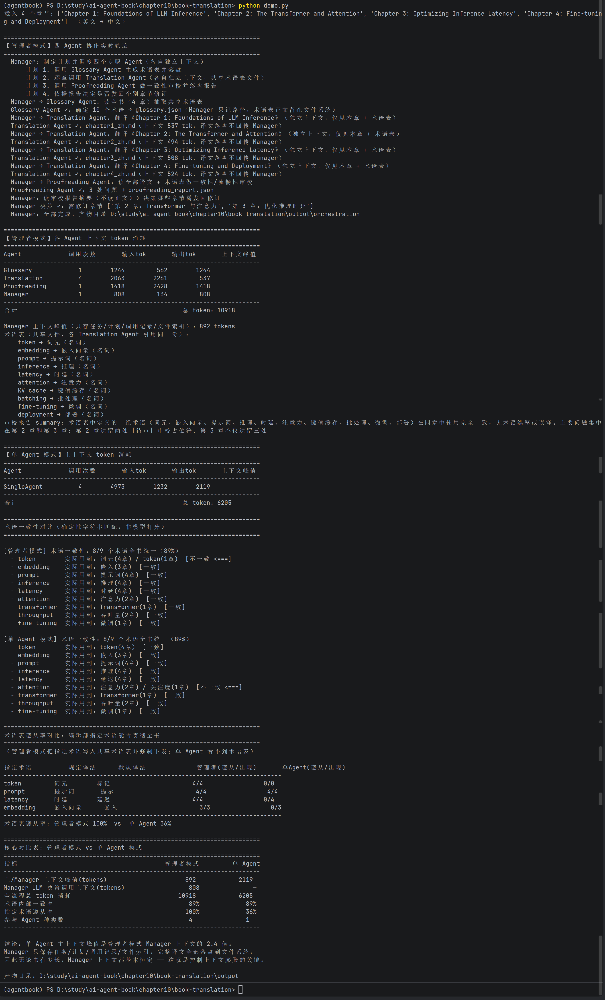

# 实验 10-2：书籍翻译多 Agent 协作实验报告

**实验日期：** 2026 年 10 月 5 日  
**实验主题：** 管理者模式（Orchestration）与单 Agent 连续翻译的对照  
**运行模型：** `mimo-v2.6-flash`（OpenAI 兼容接口）

## 1. 实验目的

本实验以英文技术书籍翻译为任务，比较两种方案：

- **管理者模式（多 Agent）**：Manager 负责规划、索引文件和决定是否修订；Glossary Agent 建立术语表；Translation Agent 分段翻译；Proofreading Agent 做全文审校。
- **单 Agent 模式**：同一个 Agent 在一段持续累积的对话上下文中依次完成全部章节翻译。

实验关注以下问题：多 Agent 是否能控制主 Agent 的上下文膨胀、改善指定术语的遵从性，并在 token、耗时和译文质量方面与单 Agent 形成怎样的取舍。

## 2. 实验环境与材料

| 项目 | 配置 |
| --- | --- |
| 运行脚本 | `demo.py`、`run_official_experiment.py` |
| 翻译模型 | `mimo-v2.6-flash` |
| 翻译方向 | 英文 → 中文 |
| 演示数据 | 内置 4 个短技术章节 |
| 正式数据 | 英文版第 1、2 章，2 章、1,684 行、239,480 B |
| 正式数据结构 | 24 个图片引用、18 个 fenced code block、6 个链接、13 个翻译单元 |
| 对照组 | 单 Agent 连续翻译 |
| 实验组 | Glossary + Translation + Proofreading + Manager 四角色协作 |

正式实验中，翻译模型和匿名质量裁判均使用本地 `.env` 中配置的 OpenAI 兼容端点。为减少位置偏差，裁判以匿名的 X/Y 译文形式比较每个翻译单元，并交替分配两个方案到 X、Y。

## 3. 实验设计

### 3.1 多 Agent 工作流

```text
英文技术书籍
     │
     ▼
Glossary Agent ──► glossary.json（共享术语表）
     │
     ▼
Translation Agent（每个单元独立上下文）──► 分段译文
     │
     ▼
Proofreading Agent ──► 审校报告
     │
     ▼
Manager Agent ──► 决定修订，并只保存计划、调用记录和文件索引
```

完整译文、术语表和审校报告通过文件系统传递。Manager 不保存完整译文，从而将主上下文与文档规模解耦。

### 3.2 评价指标

1. **主上下文峰值**：多 Agent 记录 Manager 的上下文峰值；单 Agent 记录持续会话的主上下文峰值。
2. **总 token 消耗**：记录全部翻译调用的输入与输出 token。
3. **耗时**：比较两个方案的实际墙钟时间。
4. **术语指标**：统计术语内部一致性，以及指定译法的遵从率。
5. **Markdown/代码保真度**：检查代码块、图片、链接、标题数量及其顺序。
6. **匿名质量评审**：从准确性、流畅性、术语和 Markdown/代码保真度四个维度分别按 1—5 分评分。

## 4. 演示实验结果

首先运行 `demo.py`，使用内置的 4 个短技术章节验证协作链路。终端输出见图 1。



图 1 表明四类 Agent 均被实际调用：Glossary 生成了 10 个共享术语，4 次 Translation 调用分别处理四章，Proofreading 生成审校报告，Manager 最后决定修订第 2、3 章。该小规模运行的主要结果如下。

| 指标 | 管理者模式 | 单 Agent |
| --- | ---: | ---: |
| 主/Manager 上下文峰值 | 892 tokens | 2,119 tokens |
| 总 token | 10,918 | 6,205 |
| 术语内部一致性 | 8/9（89%） | 8/9（89%） |
| 指定术语遵从率 | 100% | 36% |
| 参与的 Agent 类型数 | 4 | 1 |

演示结果说明：引入 Glossary Agent 后，多 Agent 方案能将指定术语写入共享术语表并稳定下发给每个翻译 Agent，因此指定术语遵从率显著高于单 Agent；但额外的术语提取、审校和调度调用也使其总 token 更高。这一结果适合用于验证系统流程，但样本文本较短，不能代表长文档场景。

## 5. 正式长文档对照实验结果

正式运行使用 `run_official_experiment.py`，将两章真实英文技术书拆分为 13 个 Markdown 安全的翻译单元。所有 12 项验收门禁均通过，包括四个角色实际执行、两组都完成翻译、真实 API 用量记录、裁判回执哈希、检查点指纹和产物哈希验证。

### 5.1 资源与上下文比较

| 指标 | 管理者模式 | 单 Agent | 对比结论 |
| --- | ---: | ---: | --- |
| 主上下文峰值 | 2,978 | 91,049 | 多 Agent 降低约 96.7%，单 Agent 约为其 30.6 倍 |
| 翻译总 token | 270,869 | 673,532 | 多 Agent 少用 402,663 tokens，节省约 59.8% |
| 翻译耗时 | 1,447.38 s（约 24.1 min） | 623.53 s（约 10.4 min） | 多 Agent 约慢 2.32 倍 |
| 角色/调用情况 | Glossary 1 次、Translation 18 次、Proofreading 1 次、Manager 1 次 | SingleAgent 13 次 | 多 Agent 有明确责任分工 |

从上下文和总 token 看，管理者模式优势明显。单 Agent 每翻译一个新单元都需要携带前序会话，输入 token 达到 628,411；而多 Agent 的 Translation 实例只读取“当前单元 + 术语表”，Manager 只维护元信息。代价是多 Agent 的审校、修订和多次请求增加了调用链长度，因此墙钟时间更长。

### 5.2 术语统计

| 指标 | 管理者模式 | 单 Agent |
| --- | ---: | ---: |
| 术语内部一致性 | 5/8（62.5%） | 5/8（62.5%） |
| 指定术语遵从率 | 85.7% | 33.3% |

多 Agent 对指定译法的遵从率高出 52.4 个百分点，说明共享术语表确实发挥了约束作用。不过，两组在“全局术语内部一致性”上都只有 62.5%，例如 `token`、`prompt`、`inference` 都出现了不止一种译法。这说明术语表生成后仍需更严格的逐段校验或自动替换机制，不能仅依赖提示词约束。

### 5.3 匿名质量评审

| 维度（满分 5 分） | 管理者模式 | 单 Agent |
| --- | ---: | ---: |
| 准确性 | 3.77 | 4.31 |
| 流畅性 | 4.08 | 4.38 |
| 术语 | 3.69 | 4.38 |
| Markdown/代码保真度 | 4.08 | 4.46 |
| 综合均分 | **3.90** | **4.38** |
| 裁判偏好单元数 | 2 | 9 |
| 平局 | 2 | 2 |

本次正式实验中，单 Agent 在四项匿名质量评分中均更高，且在 13 个单元中获得 9 次偏好，多 Agent 获得 2 次偏好、2 次平局。因此，本次数据不支持“多 Agent 一定能提高译文质量”的结论。

对裁判证据和多 Agent 产物的检查显示，造成该结果的主要原因包括：部分多 Agent 译文出现了 `[待审]` 占位标记、部分代码/提示串被错误翻译、个别图片或标题结构未严格保持；而单 Agent 在本次模型与任务上保持了更好的行文连贯性与 Markdown/代码保真度。需要指出的是，裁判与翻译均使用同一模型端点，尽管采用了匿名和 X/Y 交替，仍可能存在同源模型偏差；后续应改用不同模型或人工双盲评审复核。

## 6. Markdown 保真度观察

两组都成功生成非空的完整译文，并总体保留了多数代码块、图片和链接；但自动检查发现仍有结构性差异。例如：

- 多 Agent 的第 2 章图片数为 14，而源文为 17；代码块序列也没有完全保持。
- 单 Agent 的第 2 章保留了全部 14 个代码块，但图片数同样从 17 降至 14。
- 两组在不同章节中均存在标题数偏差或个别链接目标差异。

因此，Markdown 翻译任务不能只看自然语言质量。图像、代码、链接、脚注和标题应纳入自动化回归测试；必要时应将这些元素从可翻译正文中抽离并在翻译后原样回填。

## 7. 结论

1. 本实验成功完成了单 Agent 与四角色管理者模式的真实 API 对照，所有正式验收门禁通过，实验产物和裁判回执可追溯。
2. 多 Agent 最突出的收益是**控制主上下文**：本次将主上下文峰值从 91,049 降至 2,978 tokens，并减少约 59.8% 的翻译 token。
3. 共享术语表提升了指定术语遵从率（85.7% 对 33.3%），但未自动消除所有术语漂移。
4. 多 Agent 的额外协调、审校与修订使运行时间增加到单 Agent 的约 2.32 倍。
5. 在本次模型、提示词和长文档配置下，单 Agent 的匿名质量得分更高。因此，多 Agent 的价值主要体现在上下文隔离、可追溯工作流和术语规范化，而不是保证任何模型下都取得更高的译文质量。

## 8. 改进建议

- 在 Translation Agent 输出后增加规则校验：禁止 `[待审]`、禁止翻译 fenced code 和提示串、核验图片/链接/标题数。
- 将术语表从提示词约束升级为译后自动检测与定点修订，特别处理 `token`、`prompt`、`inference` 等高频词。
- 把审校任务拆分为“语言质量审校”和“Markdown 结构审校”，后者使用确定性程序完成。
- 使用与翻译模型不同的裁判模型，或增加人工双盲抽检，降低同源模型评审偏差。
- 将 Translation Agent 的修订范围限制在审校报告指出的片段，避免大段重译时引入新的结构损失。

## 9. 实验产物与可复核路径

- 演示截图：[`../images/book-translate/demo.png`](../images/book-translate/demo.png)
- 演示译文与术语表：[`../book-translation/output/`](../book-translation/output/)
- 正式实验总证据：[`../book-translation/validation/real_20261005T062715Z/evidence.json`](../book-translation/validation/real_20261005T062715Z/evidence.json)
- 最新实验摘要：[`../book-translation/validation/latest.json`](../book-translation/validation/latest.json)
- 多 Agent 完整译文：[`../book-translation/validation/real_20261005T062715Z/orchestration/`](../book-translation/validation/real_20261005T062715Z/orchestration/)
- 单 Agent 完整译文：[`../book-translation/validation/real_20261005T062715Z/single_agent/`](../book-translation/validation/real_20261005T062715Z/single_agent/)

> 注：正式证据文件中的 `experiment` 字段当前标为 `10-3`，这是运行脚本中的历史编号笔误；本报告对应的实际任务、目录与实现均为第 10 章实验 10-2“书籍翻译 Agent”。
