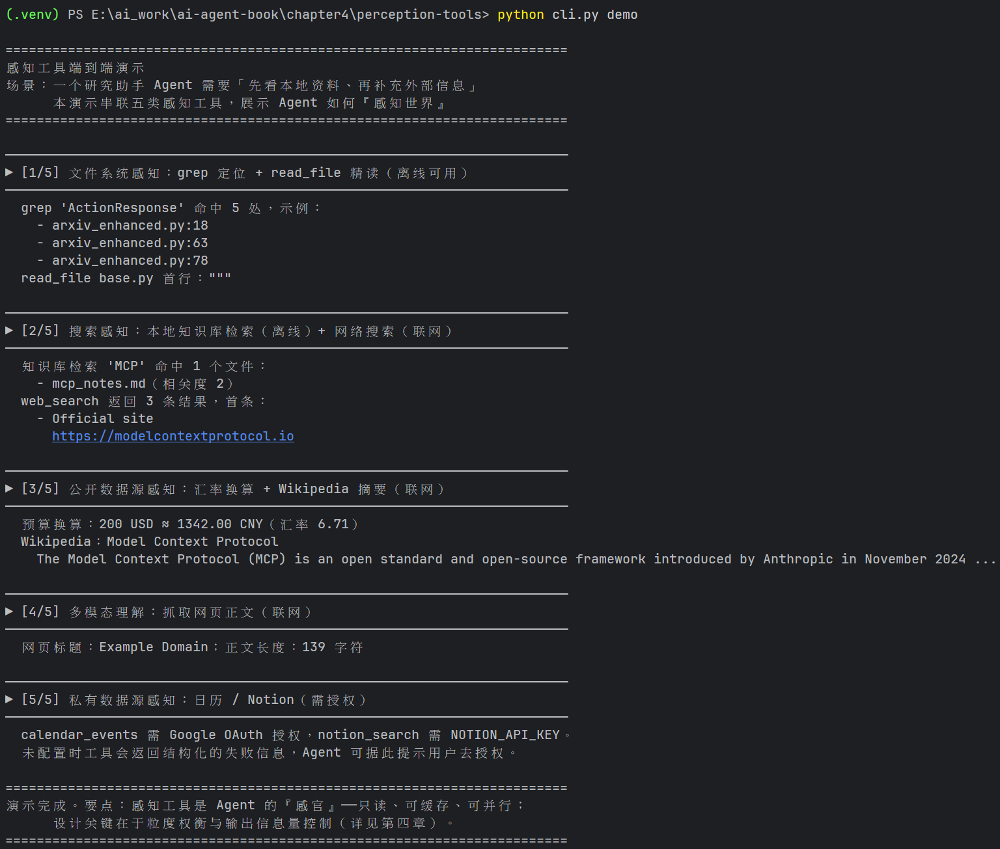
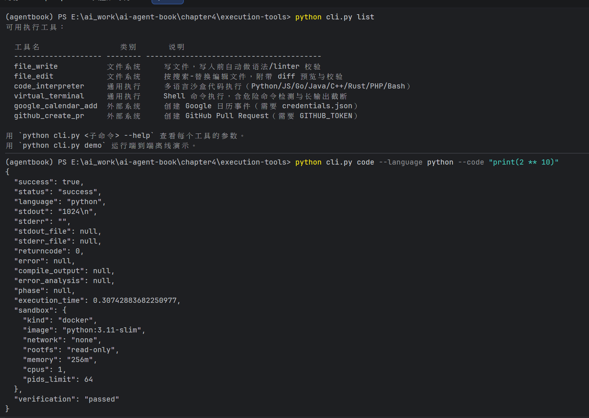

# 第四章 作业

## 思考题

### 1. MCP 未来最需要扩展的能力是什么？

**答案：把 MCP 从"请求-响应式的工具调用协议"升级为"带生命周期的任务协议"——即流式增量结果、反向通道与会话状态三者的统一。**

题目列出的三个痛点（流式输出、双向通信、有状态会话）看似独立，其实共享同一个根源：MCP 的核心原语是一次 `tools/call` 对应一次完整的 request→response，而这个模型正在过时。

- **流式输出**：深度研究、浏览器操作、长时间构建这类工具可能运行几分钟。今天只能靠 progress notification 报告百分比，无法把中间结果（如 Agent 生成的 token、日志流）持续送达。需要标准化的"分块结果"原语：任务提交 → 增量结果块 → 终止（成功/失败/取消），且每个结果块要明确"是否进入上下文、是否可被后续替换"——这直接衔接第二章的上下文工程。
- **双向通信**：今天 sampling、elicitation 已给出雏形（服务器反向请求 LLM 或用户输入），但缺的是**服务器主动向 Agent 推送事件**。这正是本章搁置的"事件触发工具"与 MCP 的接缝——第六章会展开：若 MCP 能表达"订阅-回调"，`set_timer`、`connect_channel` 这类工具就能标准化，而不必每个框架私造一套。
- **有状态会话**：长任务意味着断线重连后的任务恢复、结果补取、取消语义。没有会话状态，流式和双向都无从谈起。

三者之中应把**流式/任务生命周期**排第一：它是两者的基础（双向通信本质是任务执行中的反向消息，会话状态本质是任务状态的持久化），也是当前最痛的工程缺口。相对而言，安全与授权（OAuth）生态已在推进，紧迫性略低。

### 2. 功能重叠/同名但行为有差异的工具，Agent 如何选择？能否感知差异？

**选择策略分三层：**

1. **注册层——命名空间与去重合并**。同名遮蔽（tool shadowing）既是功能问题也是本章明列的安全风险，所以 Harness 应强制工具名带服务器前缀（`github__search` vs `local__search`），让"来源不同"成为模型可见的事实；对语义高度重叠的工具，则应用本章的**整合原则**（如 `read_document` 例），在注册时合并为一个带 `provider`/`mode` 参数的统一工具，从源头消除选择负担。
2. **描述层——把差异写成显式契约**。选择的第一依据始终是工具描述（"什么时候用"而非"能做什么"）。"一个返回摘要、一个返回全文"这种差异必须写进 description 和返回值说明，并附反例（"需要逐字引用时勿用此工具"）。差异留在隐式行为里，等于让模型猜。
3. **运行时——用返回值自描述来校准**。返回中携带 `source`、`mode`、`truncated` 等元信息，Agent 第一次调用后就能从实际输出中确认差异，并可将结论沉淀为记忆或系统提示，后续调用据此路由：要概览用摘要工具，要精确引用用全文工具。

**Agent 有没有能力感知差异？有条件的能。** 感知成立需要两个前提：差异在输出中**可见**（有截断标志、有来源标识），且模型把注意力分给了比较。反过来看，最危险的恰恰是**静默差异**——一个工具悄悄截断、悄悄改写格式，这正触犯本章"参数传递保真性"的核心原则：模型感知到的世界与工具实际操作的世界不能有系统性偏差。此时 Agent 无法自行诊断，必须靠工具描述或 Harness 层的工具元数据（README、调用示例、评测结果）来弥补。

**结论**：差异被显式表达时，Agent 不仅能感知，还能利用差异做路由；差异被隐藏时，Agent 不能，且会陷入反复试错。

### 3. "执行-验证-反馈"闭环还能用在哪？何时不可行？

**判据是：存在一个比操作更便宜、非破坏、视角独立的观测点。** 符合的场景：

- **数据写入**：数据库写后回查行数与约束，迁移脚本配 dry-run；
- **对外通信**：发送邮件/消息后回读已发内容，校验收件人、附件、模板变量是否正确渲染（发送不可逆，但"回读校验"不产生新副作用）；
- **配置修改**：重启后健康检查（本章已举）；
- **结构化产出**：API 返回做 schema 校验、Excel 写入后重算公式；
- **界面与内容**：前端改动渲染截图检查（第五章 Proposer-Reviewer 例）、长输出落盘后校验文件完整性（哈希）。

**不可行或需要克制的场景：**

1. **验证 = 重放副作用**：发邮件、打电话、转账这类一次性真实世界事件，"再验证一遍"就是再执行一遍（给客户重发确认）。验证无法与执行解耦。
2. **验证成本超过操作**：为改一行配置跑数小时全量回归；为一次免费查询重复调用付费 API。闭环的价值 = 验证成本低于错误溜走的代价。
3. **破坏性操作**：删除类操作没有"不改变状态的验证"——验证删除意味着再删一次。
4. **最终一致性与竞态**：read-after-write 有延迟，验证时刻的状态不代表执行时刻，误判"失败"后重试反而制造重复副作用——这类场景正确解法不是自动验证，而是回到**幂等键 + 先查询后变更**。
5. **验证器与执行器同源**：让同一模型自查自纠，处于相同盲区，给出虚假安全感——所以事后验证必须"模态切换"（代码→渲染截图、配置→沙盒实跑）。
6. **验证本身有风险**：对不可信代码，"实际运行来验证"本身就是攻击面——此时应降级为静态检查，或放进 microVM。

**结论**：该模式的适用前提是"验证便宜、非破坏、且提供独立视角"；不满足时退回事前审批（预检-确认两段式）、幂等性设计与沙盒 dry-run。

### 4. 除主动工具发现外，应对"工具爆炸"的方案（参考人类专家策略）

本章已有层次化组织、按需加载、检索预筛、Skills 四条，以下是补充方案，多数可从人类专家身上类比：

| 人类专家策略 | Agent 侧对应方案 |
|---|---|
| **专业分工，不通晓一切** | 按角色/场景静态裁剪工具集：把"1 个 Agent 选 1000 个工具"变成"N 个专家各选 30 个"（衔接第十章多 Agent、本章子 Agent 专业化）——**从源头减少候选，而非更快地选** |
| **形成肌肉记忆/SOP** | 高频成熟路径固化为工作流、宏或脚本，根本不经过工具选择；只有异常路径才需要决策——把"选择问题"降级为"执行问题" |
| **翻目录而非背全书** | Skills 渐进披露 + 分组分类学（search/read/parse/query 四类），系统提示词显式给出分类结构，可扩展为决策树式路由规则 |
| **有默认工具** | 置信度高时直接用默认工具，只在低置信时暴露更多候选——top-k 渐进展示，符合选择架构/希克定律：选项越多，决策越慢越易错 |
| **记住"这类任务用这个工具"** | 从成功轨迹中统计工具选择模式，沉淀为路由记忆或 Skill；配离线工具选择评测集持续监控准确率（衔接第九章能力沉淀） |
| **师徒给的 checklist** | 用廉价的规则引擎/小模型做前置粗筛（按任务类型、参数特征硬路由），LLM 只在残余候选中精挑 |

另一个正交方向是**治本**：回到"形态"决策——用通用执行器 + Skill（第五章的七个核心工具思路）或整合重叠工具，直接把工具总数压下来。工具爆炸的部分问题不是"选得慢"，而是"做得太多"。

**综合最优解是漏斗**：静态裁剪（角色）→ 规则粗筛 → 语义检索 top-k → 模型选择 → 兜底走主动发现/工具搜索 → 成功路径沉淀回前几层。主动发现只是漏斗的最后一环，而非唯一答案。

## 实验报告

### 实验 4-1：主动工具发现

（待补充）

### 实验 4-2：感知工具 MCP 服务器

**实验要求**：构建覆盖五类感知场景（搜索 / 多模态理解 / 文件系统 / 公开数据源 / 私有数据源）的 MCP 服务器，通过真实 stdio 传输跑完 28 个正式用例，逐项满足 `experiment_protocol.json` 的 fail-closed 门禁。

**执行环境**：独立 venv（Python 3.13 + **mcp 2.2.0**，钉死 `mcp>=2,<3`）、ffmpeg 9.0.2、Tesseract 5.4.0、本地 openai-whisper；视觉模型经 OpenAI 兼容接口接入 **mimo-v2.6-pro**（`OPENAI_BASE_URL` 配在被 gitignore 的 `.env` 中）。

**分阶段执行（5/5 完成）**：

| 阶段 | 内容 | 结果 |
|---|---|---|
| 0 环境 | venv + MCP SDK v2 + ffmpeg / Tesseract / Whisper / 可选集成 SDK | ✅ |
| 1 冒烟 | `smoke_test_mcp_v2.py`：stdio 启动 → 协商 `2026-07-28` → `tools/list` → `file_reader`；夹具生成链路 8/8 | ✅ |
| 2 正式 campaign | `run_experiment_4_2.py` → 28 份收据 | **blocked**（11 门禁过 10） |
| 3 验收 | README 指定的 4 个测试文件 + 新 campaign manifest 逐文件哈希 | **22/22 测试，46 文件零失配** |
| 4 记账 | 更新 `EXPERIMENT_LEDGER.md`，新旧两个 manifest 哈希交叉验证 | ✅ |

**正式运行结果**（campaign `real_mcp_20260922T153733Z`，manifest SHA-256 `9a96ef7b…a73f96`）：

- **目录门禁**：真实 `tools/list` 返回 **127 个唯一工具**，`mcp_sdk_version=2.2.0`、`protocol_version=2026-07-28`，均写入 `catalog_receipt.json`；
- **23/28 用例实质性成功**，四个类目全部 passed：DuckDuckGo 网搜与本地知识库检索、HTTPS 下载与网页阅读、PDF/DOCX/PPTX 提取、Tesseract OCR 识别出夹具标记 `EXPERIMENT 4-1`、本地 Whisper 转写出 `Experiment 4-1 Perception Tools Verified`、文件 read/grep/list/copy/move/delete 的前后 SHA-256 一致、Open-Meteo / Yahoo Finance / 汇率 / Wikipedia / arXiv 全部真实返回；
- **视觉调用留有 mimo-v2.6-pro 的原始 provider 收据**：`image_analyze` 响应 `cfe592b7…`（437+212 tokens，7.558 s，`finish_reason: stop`）、`video_analyze` 帧响应 `be463cd8…`（442+153 tokens，5.697 s）；
- **3 个越权探针全部按设计被 `PermissionError` 拒绝**（`../` 遍历、绝对路径、逃逸符号链接），且 `outside_witness_unchanged: true`——安全类门禁的"通过"形态正是"被正确拒绝"；
- **唯一 blocked：private_data**。`calendar_events` 与 `notion_search` 均返回 `missing_credentials`，credential preflight 证实环境中确实没有 Google OAuth token 与 Notion Key。协议允许该类目 `credential_blocking_allowed`，但 10/11 门禁为真、其余类目全过，故整体状态诚实地落为 **blocked** 而非 passed。

**CLI 端到端演示**（五类感知串联，`python cli.py demo`，离线步骤与联网步骤混排）：

**验收**：4 个测试文件共 **22/22 通过**——覆盖 fail-closed 缺收据拒绝、凭据失败永不伪装成功、mock 标记使成功失效、隔离探针必须保护见证文件、旧证据的诚实类目状态与 manifest 逐文件哈希、126 工具 schema 契约；协议要求的 `manifest_hashes_every_campaign_file` 对新 campaign 单独校验（46/46）亦通过。

**结论**：**blocked 是本实验在无凭据环境下的诚实终点**——五个类目四个真实通过，唯一未过的门禁恰恰是"需要真实授权"的那一个，与思考题 3 的判据互为印证：授权这类一次性真实事件不存在便宜、非破坏、视角独立的验证点，无法用"执行-验证-反馈"闭环绕过。补齐 `NOTION_API_KEY` 与 Google Calendar OAuth 后重跑，即可冲击 `official_complete: true`。

### 实验 4-3：多模态信息提取：三种技术范式的对比分析

（待补充）

### 实验 4-4：执行工具 MCP 服务器

**实验要求**：构建一套执行工具系统，重点展示安全机制的实践应用，覆盖六类工具——文件写入与编辑（写入后自动 linter 验证、返回结构化错误）、终端命令执行（超时控制、危险命令检测、命令历史追踪）、代码解释器（沙盒 Python 执行、危险操作审批、长输出总结）、数据操作（Excel 读写、公式应用、截图生成）、外部系统对接（日历事件创建、GitHub PR、邮件发送、Webhook 调用）、图形界面操作（虚拟浏览器、虚拟桌面、虚拟手机）；并为这些执行工具添加完整的安全和验证体系——文件操作的自动 linter 检查、**危险命令的 LLM 驱动审查机制**、**长输出的截断和持久化**（`book/chapter4.md` 实验 4-4 框）。

**执行环境**：Windows 11 + 独立 venv（Python 3.13 + **mcp 2.2.0**）、Docker Desktop（`python:3.11-slim` 真沙盒）、LibreOffice 26.8（公式渲染截图）、Node 26（JS 确定性 linter）、Playwright Chromium（浏览器）；危险命令审查由 **mimo-v2.6-pro**（OpenAI 兼容接口）承担，每次审查留有真实 provider 收据。

**分阶段执行（5/5 完成）**：

| 阶段 | 内容 | 结果 |
|---|---|---|
| 0 环境 | venv + 依赖全量 + Docker 镜像 + LibreOffice + Playwright | ✅ |
| 1 冒烟 | `cli.py demo` 7 步端到端 + `quickstart.py` + 审批双场景校验 + 截断格式核对 | ✅ |
| 2 正式 campaign | `run_experiment_4_4.py` → 21 份收据走真实 MCP stdio | **blocked**（15 门禁过 10） |
| 3 验收 | 6 个 campaign 逐文件哈希校验 + 测试全套复跑 | **pytest 63/63，零失配** |
| 4 记账 | 更新 `EXPERIMENT_LEDGER.md` | ✅ |

**正式运行结果**（campaign `real_mcp_20260923T125311Z`，manifest SHA-256 `f3fc7481d0d44a5dc94ea07f878d92925915c94703a76be9f3a0f78754c75f0f`，21 份收据；同日另有对照 run `real_mcp_20260923T115618Z`（manifest `e3dcca31935fd2b3979ed10acfb51793bf88ba4e1c365dcc5d6e5d3504e98332`），两者的 `schema_sha256` 完全一致，互为交叉印证）。

实验要求的三大安全机制各有直接证据：写入自动 linter（收据 01–04）、危险命令的 LLM 驱动审查（收据 09 + `llm_receipts.json`）、长输出截断与持久化（收据 12 + 落盘文件）。15 个验收门禁的**结果—证据对照**如下（收据均位于 `validation/experiment_4_4/real_mcp_20260923T125311Z/receipts/`，编号即文件名前缀）：

| # | 结果（验收门禁） | 判定 | 证据 |
| --- | --- | --- | --- |
| 1 | MCP 目录与调用（`real_mcp_catalog_and_calls`） | ✅ | `catalog.json`：真实 `tools/list` 返回 **13 个工具 schema**，`schema_sha256=56172624f62c914b…`，六类工具全覆盖；21 份调用收据（01–21） |
| 2 | 双 linter 自动校验（`python_and_javascript_linter`） | ✅ | 01/03 合法代码写入 `verification=passed`；02 非法 Python 被拒（`Syntax error at line 1: invalid syntax`）；04 非法 JS 被拒（Node `--check` 精确定位 `const broken = ;`） |
| 3 | 编辑校验与越权拒绝（`file_edit_verified_and_escape_rejected`） | ✅ | 05 编辑成功，带 diff 预览、`verification=passed`；06 `../../escape.py` 被拒（`Path … is outside workspace directory`）；见证文件 `outside-witness.txt`（内容 `MUST-NOT-CHANGE`，SHA-256 `9568b54e…`）运行前后未变 |
| 4 | 终端超时与危险命令审查（`terminal_timeout_and_llm_danger_review`） | ✅ | 07 安全命令 `returncode=0`；08 超时被终止（`Command timed out after 1 seconds`）；09 `rm -rf` 被拒（`Command execution not approved: … irreversible …`）；审查收据 `a6fa5903…`（mimo-v2.6-pro，632 tokens，13.641 s，`finish: stop`） |
| 5 | 真沙盒断网（`real_python_container_sandbox`） | ✅ | 10 `sandbox.kind=docker`（`--network none`、read-only rootfs、256MB/1 CPU/64 PID 限额）；11 断网探针在容器内抛出 `URLError`（stdout 实录） |
| 6 | 长输出截断持久化（`long_output_truncated_and_persisted`） | ✅ | 12 上下文仅留 102 行 + `... [省略 161 行，完整输出已保存至 …]` 标记 + `read_file` 引导；完整输出 `artifacts/long_output.full.txt` 2,600 bytes，SHA-256 `9c69930e…` 入 manifest |
| 7 | Excel 公式与截图（`real_excel_formula_and_screenshot`） | ✅ | 13 三件产物带哈希：xlsx 5,079B `0fd7d236…`、pdf 26,195B `5c4410da…`、png 14,409B `aa62c96c…`；公式单元格 D2–D4（`=B*C` 与 `=SUM`） |
| 8 | 真实 Webhook（`real_webhook`） | ✅ | 14 postman-echo HTTP 200，响应体回显 marker `REAL-WEBHOOK-RECEIPT`，响应 SHA-256 `014795a5…` |
| 9 | 真实浏览器（`real_browser`） | ✅ | 15 Playwright Chromium 导航 HTTP 200，title `Example Domain`，截图 png 13,697B，SHA-256 `4750498d…` |
| 10 | LLM 收据完整性（`credential_free_usage_latency_receipts`） | ✅ | `llm_receipts.json` 2 行均有真实 `response.id`/`usage`/`latency`：`a6fa5903…`（632 tokens，13.641 s）、`e48f8e4e…`（667 tokens，10.936 s） |
| 11 | 日历真实变更（`real_calendar_mutation`） | ⛔ | 16 `Failed to initialize Google Calendar: Credentials file not found: credentials.json` |
| 12 | GitHub PR 真实变更（`real_github_pr_mutation`） | ⛔ | 17 `Failed to initialize GitHub client: GitHub token not configured` |
| 13 | 邮件真实发送（`real_email_mutation`） | ⛔ | 18 `Email provider credentials not configured: SMTP_HOST, SMTP_USER, SMTP_PASSWORD` |
| 14 | 虚拟桌面会话（`real_virtual_desktop_session`） | ⛔ | 19 `Missing desktop executables: ['Xvfb', 'xdotool', 'chromium']` |
| 15 | 虚拟手机会话（`real_virtual_mobile_session`） | ⛔ | 20 `AndroidWorld container is not running`；21 能力探测实录 `android_active_devices: []`、`android_world_adb_present: false` |

> LLM 审查收据完整 id（按调用顺序）：`a6fa5903-7ba9-4c62-82bf-421ef29cac03_10e7d8c395224f9faaf4c759338c5837`（`rm -rf` 审查，拒绝）、`e48f8e4e-33cc-4218-9642-2c91c6703ba5_0f83640cbfc549b69c097cbd7304d45d`（沙盒网络探针审查，放行）——一拒一放，证明审查在判风险而非无差别拦截。

**CLI 演示**（`python cli.py list` 与 `python cli.py code`，即上表第 1、5 行的终端实录）：

上半图 `cli.py list` 按"文件系统 / 通用执行 / 外部系统"分类列出 CLI 可直接调用的执行工具及其说明；下半图 `cli.py code` 在 Docker 沙盒执行 `print(2 ** 10)` 返回 `1024`，响应完整回显上表第 5 行检查的全部字段——`sandbox.kind: docker`、`network: none`、`rootfs: read-only`、`memory: 256m`、`cpus: 1`、`pids_limit: 64`、`verification: passed`，与收据 10 的证据字段逐项对应。

**证据链自校验**：`summary.json` 记录 status=blocked、10/15 门禁与五项 blockers；`manifest.json` 覆盖 34 个文件、逐个 SHA-256 对账零失配（manifest 自身 SHA-256 `f3fc7481…`）；`latest.json` 指针自洽；对照 run `e3dcca31…` 与本次 `schema_sha256` 一致；旧 canonical run 的 manifest 哈希 `fde8976b91b149a61b7d468f4c825c1bdfdc9da3062cbfa66aaa1fd0f3d1966f` 还原后验证通过。

**结论**：blocked 是本实验在当前环境下的诚实最优。15 个门禁 10 个真实通过，恰好覆盖实验要求的三大安全机制（自动 linter、LLM 危险命令审查、长输出截断持久化）；5 个未过者全部卡在凭据或外部后端（Google Calendar OAuth、SMTP、GitHub token、X11/KVM GUI 后端），协议不允许用 mock 伪装这些一次性真实事件的成功。

### 实验 4-5：协作工具 MCP 服务器

（待补充）
