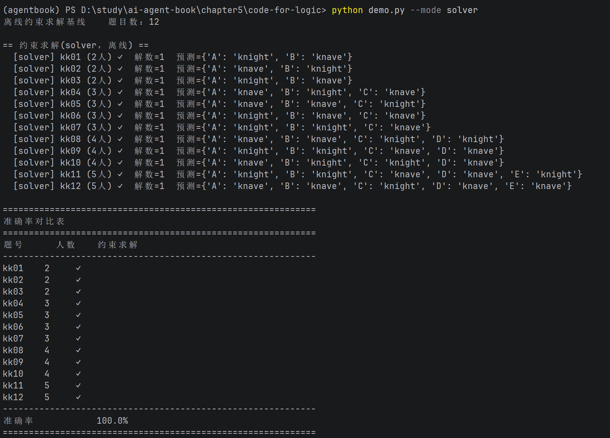
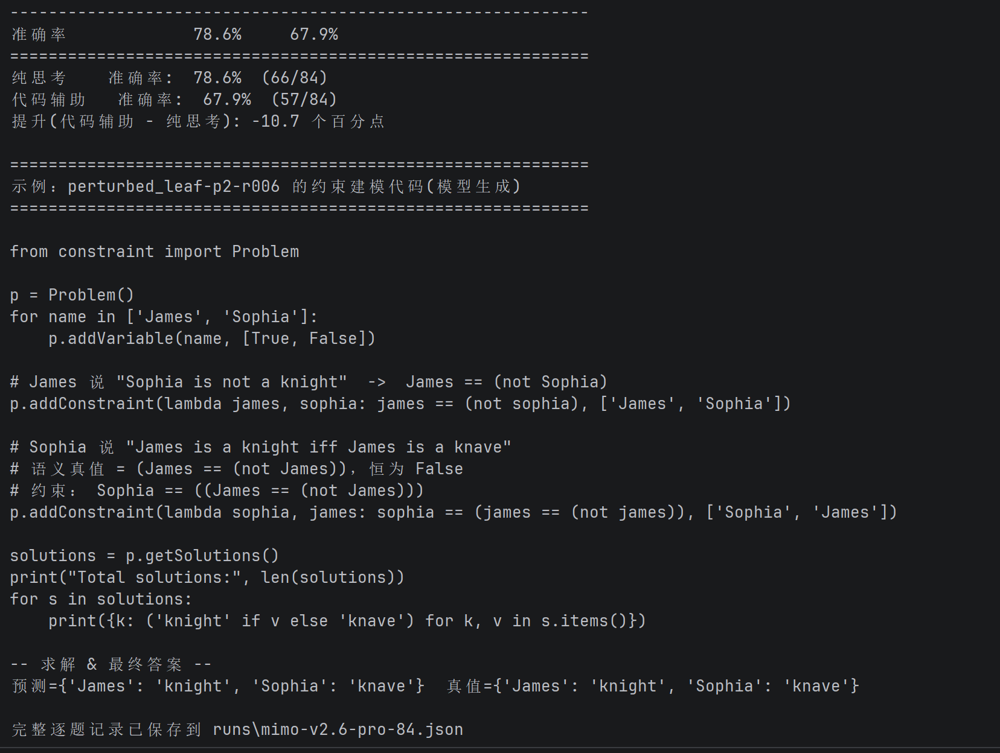

# 实验 5-4：代码辅助逻辑推理测试报告

## 1. 实验信息

| 项目 | 内容 |
| --- | --- |
| 实验名称 | 使用代码生成工具提升逻辑思考能力 |
| 正文编号 | 实验 5-4 |
| 代码目录旧编号 | 实验 5-2（目录与运行记录中的历史编号） |
| 测试模型 | `mimo-v2.6-pro` |
| 接口类型 | OpenAI 兼容接口 |
| 运行模式 | `both`：纯思考（pure）与代码辅助（code）配对对照 |
| 数据集 | 固定版本的 K-and-K `perturbed-knights-and-knaves`，84 题 |
| 运行完成时间 | 2026-09-29 15:38:52 UTC（2026-09-29 23:38:52，UTC+8） |

> API 密钥未记录在本报告中。

## 2. 实验目的

考察模型解决“骑士与无赖”逻辑谜题时，令其生成并调用 `python-constraint` 约束求解代码，是否能比仅使用自然语言推理取得更高准确率。

## 3. 测试环境与方法

- Python 3.12 虚拟环境；依赖包括 `openai` 与 `python-constraint`。
- 每个测试样本分别运行纯思考臂和代码辅助臂，共 84 组配对结果。
- 代码辅助臂要求模型生成约束建模代码，并由求解器执行后给出答案。
- 使用双侧精确 McNemar/二项检验比较两臂在配对样本中的正确性差异。
- 离线求解器另作为机制基线，用于验证给定结构化题目可以被约束求解器稳定求解。

## 4. 运行结果

### 4.1 离线约束求解基线

对 12 道精选题运行 `solver` 模式，所有题目均得到唯一解且预测正确，准确率为 **100.0%（12/12）**。

这说明项目中的结构化题目到约束系统的转换，以及 `python-constraint` 求解链路均可正常工作。该结果仅验证确定性求解器基线，不替代 LLM 对照实验。

### 4.2 正式配对对照实验

| 指标 | 纯思考（pure） | 代码辅助（code） |
| --- | ---: | ---: |
| 正确题数 | 66 / 84 | 57 / 84 |
| 准确率 | **78.6%** | **67.9%** |
| 代码辅助相对纯思考变化 |  | **-10.7 个百分点** |

配对差异统计：纯思考独自答对 10 题，代码辅助独自答对 1 题，共 11 个不一致样本；双侧精确检验 `p = 0.01171875`。全部 84 条代码辅助轨迹均调用了 `python-constraint`，且运行记录中没有供应商错误。

## 5. 验收结论

实验执行本身**完成**：84 道固定题目、两条实验臂、完整配对结果、无供应商错误，且代码辅助臂均实际使用了约束求解工具。

按原始评分，预期“代码辅助准确率超过 90%，且显著高于纯思考”**未通过**：代码辅助为 67.9%，低于纯思考的 78.6%，差异方向与预期相反。逐题复盘发现该原始统计包含标签解析、题面/金标冲突与多解题目等问题；因此它只能作为“原始评分下的负结果”，不能直接推导出“代码工具降低了模型推理能力”的结论。详见第 6 节。

## 6. 负结果复盘

原始评分显示代码辅助比纯思考低 10.7 个百分点，但逐题检查表明，该差异主要来自评测链路与数据集质量问题，不能直接解释为“代码工具降低了模型推理能力”。

### 6.1 `random_pair`：身份术语未被评分器识别

`random_pair` 的题面会把“骑士/无赖”替换为其他成对身份词，例如 `saint/sinner`、`angel/devil`、`hero/villain`、`altruist/egoist`、`pioneer/laggard` 和 `sage/fool`。模型在代码辅助臂中通常沿用题面术语输出答案；但评分器 `parse_answer()` 只接受 `knight/knave`、中文“骑士/无赖”或布尔值，因而将 13 条代码辅助结果记为 `null` 预测。

逐项对照后，其中 12 条的身份分配与金标在语义上相同，只是输出标签不同。纯思考臂也有 3 条相同类型的误判。这属于**输出契约未满足和评分器归一化不足**，而不是逻辑求解错误。生产场景应使用 JSON Schema 枚举约束最终标签，或由评分器根据题面中的角色定义自动归一化同义身份词。

### 6.2 `flip_role`：题面规则与金标冲突

`flip_role` 的 14 个样本把角色规则反转为“knave 说真话、knight 说假话”。模型在纯思考和代码辅助两臂均按照题面反转规则推理，却被以常规“knight 说真话、knave 说假话”含义编码的金标判错，导致两臂在这一子集上均为 0/14。

例如 `flip_role-p2-r007` 中，题面规则下两位居民均应为说谎者 `knight`；运行记录中的两臂均给出该答案，而金标记录为 `knave`。因此，这一子集不宜用于评价模型准确率，除非重新按题面语义生成金标。

### 6.3 `random_pair-p6-r045`：题目并非唯一解

代码辅助臂对 `random_pair-p6-r045` 生成的约束模型枚举出两个满足所有题面陈述的解，并据此报告“题目无法唯一确定”。本地复跑该生成代码同样得到两个解；但数据集仅预存其中一个解为金标，故该合理的“多解”判断被计为错误。正式评测应在运行前用独立求解器按照题面实际规则复核每道题的唯一性，并剔除或单列多解样本。

### 6.4 修正口径下的结果

| 统计口径 | 纯思考 | 代码辅助 |
| --- | ---: | ---: |
| 原始严格评分 | 66/84，78.6% | 57/84，67.9% |
| 归一化身份同义词后 | 69/84，82.1% | 69/84，82.1% |
| 再排除 14 道题面/金标冲突样本后 | 69/70，98.6% | 69/70，98.6% |

因此，较可靠的解释是：本次实验**没有观察到代码辅助相对纯思考的优势**；但原始的 -10.7 个百分点差异大部分由标签解析和数据标注缺陷造成。在通过统一输出格式、修复反转角色样本、排除多解样本后，两个实验臂在有效样本上基本持平。

## 7. 可追溯证据

- 正式逐题运行记录：[mimo-v2.6-pro-84.json](../code-for-logic/runs/mimo-v2.6-pro-84.json)
- 离线基线截图：[demo-solver.png](../images/code-for-logic/demo-solver.png)
- 正式实验截图：[demo-正式.png](../images/code-for-logic/demo-正式.png)
